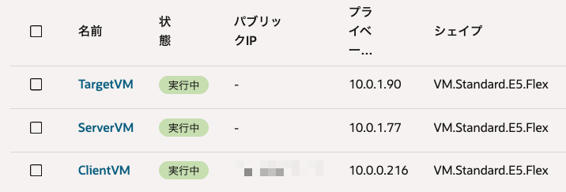
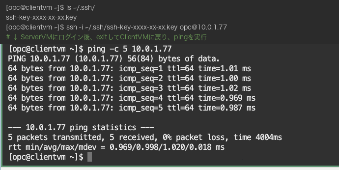
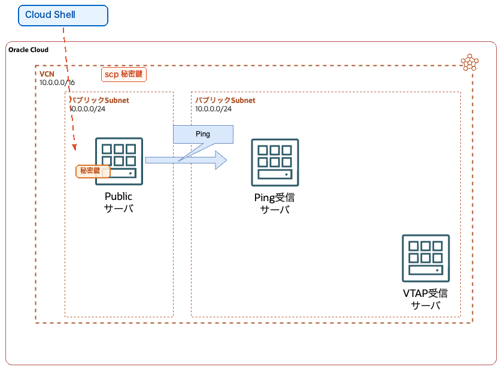
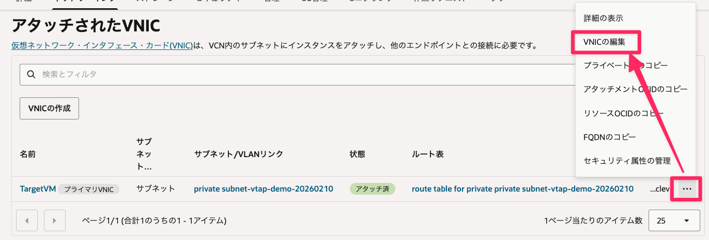
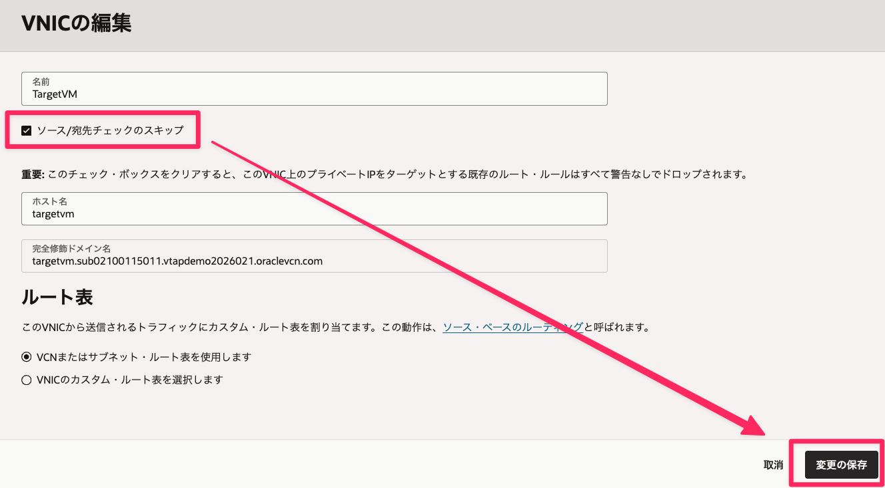
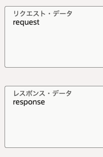
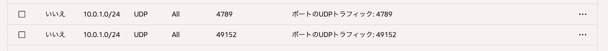
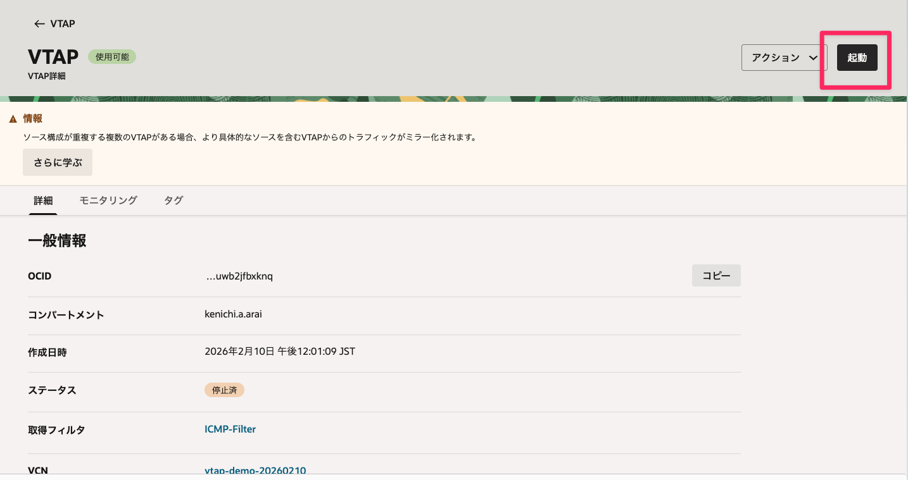

# OCIハンズオン-VTAP編

1. ハンズオン-前提と構成イメージ
2. 動作確認用事前準備
3. VTAP設定
4. 動作確認

## 1. ハンズオン-前提と構成イメージ
- VCNの作成が完了しており、そのVCN内にデフォルトのプライベート・サブネットとパブリック・サブネットが作成されていること
   - 本ハンズオンはVCN[10.0.0.0/16],パブリックサブネット[10.0.0.0/24],プライベートサブネット[10.0.1.0/24]を前提としています
- パブリック・サブネットにSSH接続が可能な環境があること

・ハンズオン完成イメージ


## 2. 動作確認用事前準備

### 2-1. Compute作成1.パブリックサブネットクライアント用の作成
1. コンソールのナビゲーションメニューから [コンピュート]→ [インスタンス]を選択
2. インスタンスの作成を選択
3. 以下の設定で作成。下記以外はデフォルトのまま。

|大項目|中項目|設定値|
|---|---|---|
|名前||ClientVM|
|コンパートメントに作成||（自分のコンパートメント）|
|イメージとシェイプ|イメージ|OracleLinux|
||Shape|AMD - VM.Standard.E5.Flex 等|
|プライマリVNIC情報の編集|VCN|（作成済みのVCN）|
||サブネット|作成済みのパブリック・サブネット|
|SSHキーの追加||キーペアの自動生成（＆キーのダウンロード）<br>※3台すべて同じキーペアを使用|

### 2-2. Compute作成2.プライベートサブネットPing受信サーバ用
1. コンソールのナビゲーションメニューから [コンピュート]→ [インスタンス]を選択
2. インスタンスの作成を選択
3. 以下の設定で作成。下記以外はデフォルトのまま。

|大項目|中項目|設定値|
|---|---|---|
|名前||ServerVM|
|コンパートメントに作成||（自分のコンパートメント）|
|イメージとシェイプ|イメージ|OracleLinux|
||Shape|AMD - VM.Standard.E5.Flex 等|
|プライマリVNIC情報の編集|VCN|（作成済みのVCN）|
||サブネット|作成済みのプライベート・サブネット|
|SSHキーの追加||キーペアの自動生成（＆キーのダウンロード）<br>※3台すべて同じキーペアを使用|

※作成後、ServerVMのプライベートIPアドレスを控えておいてください。

### 2-3. Compute作成3.VTAP受信用
1. コンソールのナビゲーションメニューから [コンピュート]→ [インスタンス]を選択
2. インスタンスの作成を選択
3. 以下の設定で作成。下記以外はデフォルトのまま。

|大項目|中項目|設定値|
|---|---|---|
|名前||TargetVM|
|コンパートメントに作成||（自分のコンパートメント）|
|イメージとシェイプ|イメージ|OracleLinux|
||Shape|AMD - VM.Standard.E5.Flex 等|
|プライマリVNIC情報の編集|VCN|（作成済みのVCN）|
||サブネット|作成済みのプライベート・サブネット|
|SSHキーの追加||キーペアの自動生成（＆キーのダウンロード）<br>※3台すべて同じキーペアを使用|

※作成後、TargetVMのプライベートIPアドレスを控えておいてください。

・ここまでで以下の3台のComputeインスタンスを作成




### 2-4. 設定1. プライベートサブネットのセキュリティリスト編集( ping許可用)
1. コンソールのナビゲーションメニューから [ネットワーキング]→ [仮想クラウド・ネットワーク]を選択
2. 右ペインから、対象のVCNの名前部分をクリック
3. 画面上部の[サブネット]タブを選択し、画面下部からプライベートサブネットをクリック
4. 画面上部の[セキュリティ]タブを選択し、画面下部のセキュリティリストの名前部分をクリック
5. 画面上部の[セキュリティルール]タブを選択し、イングレス・ルールの追加をクリック
6. 以下の設定で、Ping疎通の許可設定を作成。下記以外の部分はデフォルトのまま。

|項目|設定値|
|---|---|
|ソースタイプ|CIDR|
|ソースCIDR|10.0.0.0/24|
|IPプロトコル|ICMP|
|タイプ|8|


### 2-5. 設定2. Ping受信サーバのファイアウォール停止
1. ServerVM（Ping受信サーバ）にSSHログインする（※ClientVMを踏み台にしてのCloud Shellでのログイン)
2. 以下のコマンドを入力して、ServerVM内のファイアウォールを停止する

```
sudo systemctl stop firewalld
```

> **備考：Cloud ShellからClientVMを踏み台にしてプライベートサブネットのサーバにSSHする場合**
>
> プライベートサブネットのサーバ（ServerVM, TargetVM）にはパブリックIPがないため、ClientVMを踏み台（Bastion）として経由する必要があります。
> 1. Cloud Shellにダウンロード済みの秘密鍵をアップロードします（Cloud Shell右上の歯車アイコン → アップロード）。
> 2. アップロードした秘密鍵のパーミッションを変更します。
>    ```
>    chmod 600 <秘密鍵ファイル名>
>    ```
> 3. Cloud ShellからClientVMにSSHし、秘密鍵をClientVMにコピーします。
>    ```
>    scp -i <秘密鍵ファイル名> <秘密鍵ファイル名> opc@<ClientVMのパブリックIP>:~/.ssh/
>    ```
> 4. ClientVMにSSHログインし、同じ秘密鍵を使ってServerVMに接続します。
>    ```
>    ssh -i <秘密鍵ファイル名> opc@<ClientVMのパブリックIP>
>    ssh -i ~/.ssh/<秘密鍵ファイル名> opc@<ServerVMのプライベートIP>
>    ```

### 2-6. Ping受信確認
1. ClientVM（パブリックサブネット）にSSHログインする
2. 以下のコマンドを入力して、Ping受信サーバにpingする。

```
ping -c 5 <ServerVMのプライベートIP>
```

3. 正常にコマンドが成功することを確認（5 packets transmitted, 5 received, 0% packet loss)



### 動作確認手順まとめ
ここまででVTAPの動作確認の準備が完了です。




## 3. VTAP設定
ここからはいよいよVTAPの設定を行います。

VTAPはミラーされたパケットを受け取るロードバランサ（NLB）と、
ロードバランサの先にパケット受信用サーバ（2-3で作成済）が必要になります。

### 3-1. ターゲットサーバの設定その1(サーバ)
1. TargetVM（パケット受信サーバ）にSSHログインする（※ClientVMを踏み台にしてのCloud Shellでのログイン)
2. 以下のコマンドを入力して、TargetVM内のファイアウォールを停止する

```
sudo systemctl stop firewalld
```

3. 以下のコマンドを入力して、VTAP動作確認用にUDPサーバを建てるためのパッケージをインストールします。

```
sudo yum -y install nmap-ncat.x86_64
```

4. パッケージがインストールされたことを確認（バージョン情報が返ってくればOK）

```
nc -v
```

5. 以下のコマンドを入力して、VTAP動作確認用にUDPサーバを建てる
(49152ポートでリクエストを受信する状態になります。)

```
while true; do (echo "response") | nc -lu 49152 -i 1; done > /dev/null 2>&1 &
```

### 3-2. ターゲットサーバの設定その２(VNIC)
1. コンソールのナビゲーションメニューから [コンピュート]→ [インスタンス]を選択
2. 右ペインのTargetVM（VTAP動作確認サーバ）の名前部分のリンクをクリック
3. 画面上部の[ネットワーキング]タブを選択し、[アタッチされたVNIC]欄の名前部分一番右の[⋯]→[VNICの編集]をクリック



5. ソース/宛先チェックのスキップにチェックを入れて、変更の保存ボタンをクリック




### 3-３. ロードバランサの作成NLB
1. コンソールのナビゲーションメニューから [ネットワーキング]→ [ネットワーク・ロード・バランサ]を選択
2. [ネットワーク・ロード・バランサの作成]をクリック
3. 以下の設定でロードバランサを作成する。下記以外の部分はデフォルトのまま。

|項目|設定値|
|---|---|
|ロードバランサ名|for-vtap|
|可視性タイプ|プライベート|
|ネットワーキング（VCN）|（作成済みのVCNを選択）|
|ネットワーキング（サブネット）|（プライベート・サブネットを選択）|

4. 次へをクリックし、以下の設定でリスナー（ロードバランサが受信するトラフィック）を作成する。下記以外の部分はデフォルトのまま。
   
|項目|設定値|
|---|---|
|リスナー名|NLB-listener|
|トラフィックのタイプ|UDP|
|タイムアウト|120|
|イングレス・トラフィック・ポート|ポートを指定 → 4789 |

※VTAPはミラーしたパケットを4789に送信する仕様となっております。

5. 次へをクリックし、以下の設定でバックエンドセットを作成します。下記以外の部分はデフォルトのまま。

|大項目|中項目|設定値|
|---|---|---|
|バックエンドセット名||backendset|
|バックエンドの追加をクリック|バックエンド・タイプ|コンピュート・インスタンス|
||IPアドレス|<当該コンピュートのプライベートIP>|
||コンピュートインスタンス|TargetVM|
||ポート| 49152 |
|ヘルス・チェック・ポリシーの指定|プロトコル|UDP|
||リクエスト・データ| request |
||レスポンス・データ| response |



### 3-4. プライベートサブネットのセキュリティリスト編集(vtap許可用)
1. コンソールのナビゲーションメニューから [ネットワーキング]→ [仮想クラウド・ネットワーク]を選択
2. 右ペインから、対象のVCNの名前部分をクリック
3. 画面上部の[サブネット]タブを選択し、画面下部のサブネット一覧からプライベート・サブネットの名前部分をクリック
4. 画面上部の[セキュリティ]タブを選択し、画面下部のセキュリティ・リストの名前部分をクリック
5. 画面上部の[セキュリティ・ルール]タブを選択し、イングレス・ルールの追加をクリック
6. 以下の設定で、VTAP送受信の許可設定を作成。下記以外の部分はデフォルトのまま。

|項目|設定値|
|---|---|
|ソースタイプ|CIDR|
|ソースCIDR|10.0.1.0/24|
|IPプロトコル|UDP|
|宛先ポート範囲|4789,49152|




### 3-5. 取得フィルタ作成
1. コンソールのナビゲーションメニューから [ネットワーキング]→ [ネットワーク・コマンド・センター] → [取得フィルタ]を選択
2. 右ペインの[取得フィルタの作成]をクリック
3. 以下の設定で、取得フィルタを作成。下記以外の部分はデフォルトのまま。

|項目|設定値|
|---|---|
|名前|ICMP-Filter|
|コンパートメント|(作成済みのコンパートメント)|
|フィルタタイプ|VTAPでの使用|
|サンプリングレート|100%|

ルールの追加をクリックし、以下の設定でルールを作成します。

|項目|設定値|
|---|---|
|トラフィック|すべて|
|包含/除外|含める|
|ソースCIDR|10.0.0.0/24|
|宛先CIDR|10.0.1.0/24|
|IPプロトコル|ICMP|
|ICMPタイプ|8 — エコー|
|ICMPコード|0 — エコー・リクエスト|


### 3-6. VTAP作成
1. コンソールのナビゲーションメニューから [ネットワーキング]→ [ネットワーク・コマンド・センター] → [VTAP]を選択
2. 右ペインの[VTAPの作成]をクリック
3. 以下の設定で、VTAPを作成。下記以外の部分はデフォルトのまま。

|大項目|中項目|設定値|
|---|---|---|
|名前||VTAP|
|コンパートメント||(作成済みのコンパートメント)
|VCN||(作成済みのVCN)|
|ソース|ソース・タイプ|インスタンスVNIC|
||サブネット| (プライベートサブネット)|
||VNIC|ServerVMのVNICを指定|
|ターゲット|リソース・タイプ|ネットワーク・ロード・バランサ|
||サブネット|(プライベートサブネット)|
||ネットワーク・ロード・バランサ|（先ほど作成したロードバランサ）|
|取得フィルタ||(先程作成したフィルタ)|
||名前|ICMP-Filter|
||コンパートメント|(作成済みのコンパートメント)|
||トラフィックの方向|イングレス|
||ソースのIPv4またはIPv6|10.0.0.0/24|
||宛先のIPv4またはIPv6|10.0.1.0/24|
||IPプロトコル|ICMP|


### 3-6. VTAP起動
作成完了後のVTAPは停止中となっているため、[起動]をクリックし、
実行中になったことを確認する。



ここまででVTAP設定が完了しました。

ハンズオン完成イメージ（再掲）


## 4. 動作確認

動作確認では、TargetVMでtcpdumpを実行しながら、ClientVMからpingを打つため、2つのSSHセッションが必要です。
Cloud Shellでtmuxを使って画面分割を行います。

### 4-1. tmuxの起動と画面分割
1. Cloud Shellで以下のコマンドを実行し、tmuxを起動します。
   ```
   tmux
   ```
2. tmux起動後、以下のキー操作で画面を左右に分割します。
   - `Ctrl+B` を押した後、`%`（パーセント）を押す
3. 左ペインと右ペインの2画面が表示されます。ペイン間の移動は以下のキー操作で行います。
   - `Ctrl+B` を押した後、`←` または `→`（矢印キー）を押す

### 4-2. 左ペイン：TargetVMでtcpdumpを実行
1. 左ペインで、ClientVM経由でTargetVMにSSHログインします。
   ```
   ssh -i <秘密鍵ファイル名> opc@<ClientVMのパブリックIP>
   ssh -i ~/.ssh/<秘密鍵ファイル名> opc@<TargetVMのプライベートIP>
   ```
2. NLBヘルスチェック用のUDPリスナーが起動しているか確認します。
   ```
   ss -uln | grep 49152
   ```
   出力がない場合はUDPリスナーが停止しています。以下のコマンドで再起動してください。
   ```
   while true; do (echo "response") | nc -lu 49152 -i 1; done > /dev/null 2>&1 &
   ```
   ※ NLBがTargetVMを正常と認識するまで1〜2分かかる場合があります。
3. ネットワークインターフェース名を確認します。
   ```
   ip -br link
   ```
   ※ `lo` 以外のインターフェース名（例: `enp0s3` 等）を確認してください。
4. 以下のコマンドを実行して、ミラーリングされたパケットを待ち受けます（`<NIC名>` は上記で確認した名前に置き換え）。
   ```
   sudo tcpdump src host <ServerVMのプライベートIP> -vv -i <NIC名>
   ```

### 4-3. 右ペイン：ClientVMからPingを実行
1. `Ctrl+B` → `→` で右ペインに移動します。
2. 右ペインで、ClientVMにSSHログインします。
   ```
   ssh -i <秘密鍵ファイル名> opc@<ClientVMのパブリックIP>
   ```
3. 以下のコマンドを実行して、ServerVM（Ping受信サーバ）にPingを送信します。
   ```
   ping -c 5 <ServerVMのプライベートIP>
   ```

### 4-4. 結果確認
1. 左ペイン（`Ctrl+B` → `←`）に戻り、TargetVMのtcpdump出力にPingパケットが表示されていることを確認します。
   パケットが表示されていれば、VTAPによるミラーリングが正常に動作しています。


> **備考：tmuxの終了方法**
> 動作確認が完了したら、各ペインで `exit` を入力してSSHセッションを閉じた後、`Ctrl+B` → `x` → `y` でペインを閉じます。
> すべてのペインを閉じるとtmuxが自動的に終了します。


<!-- 以下コメントアウト

## Extra. VPCフローログの設定


## 2. サーバインスタンス作成&ping疎通確認

（すでに自動割り当てされてるプライベートIPアドレスを要確認）プライベートIPアドレスの手動割当 10.0.1.2

拡張オプションの表示は不要

セキュリティリストのpingポートを開ける ← いったんなし

## 3. バックエンドインスタンスの作成

手順と画像は2−1のまんまでOK
同じ設定の49152を作る、をもうちょっと丁寧に書く

ncatコマンドとは
ネットワークの疎通確認コマンド

## 4. NLBの作成
orasejapanはMAX NLB制限にひっかかって断念。

Flexible Network Load Balancer Count	max-nlb-flexible-count の制限解除リクエスト必須

## 5. VTAPの作成

基本的にチュートリアルの通りでOK
要所要所で画像いれないとわけわかんなくなるので作る
最初にVTAPについて詳細を解説する。
解説元はSpeakerdeckで
https://speakerdeck.com/ocise/oci-jia-xiang-tesutoakusesupointo-vtap-gai-yao


## 6. 確認
デモにする

## 確認
このコマンドの意味

（ターゲット・インスタンスに送信されるヘルスチェックのリクエストを受け入れ、レスポンスを返すため、ここではncatコマンドを用います。まずは以下のコマンドでnmap-ncatパッケージをインストールします）
ncコマンドとは

–l
リモートホストへの接続を開始せずに、着信する接続を待機します。

–u
デフォルトのオプションである TCP の代わりに UDP を使用します。

–i interval
テキスト行の送受信間隔 (interval) の遅延時間を指定します。

echoをつけて、responseを受け取ったときの動作とするサーバにする。
responseは、NLBで指定している。

(UDPサーバを建て、NLBのヘルスチェックのリクエストを待機します)
 while true; do (echo "response") | nc -lu 49152 -i 1; done > /dev/null 2>&1 &

(サーバ・インスタンスからミラーリングされて流れてくるパケットを待ち受けます)
 sudo tcpdump src host <ServerVMのプライベートIP> -vv -i <NIC名>

> src host HOST	パケットの送信元ホストがHOSTであれば真
> -vv	-vよりも詳細に出力する（NFS応答パケットの追加フィールドなども表示される）
> -i INTERFACE	ネットワーク・インターフェースINTERFACEを監視する
> NIC名はOSバージョンやシェイプによって異なるため、`ip -br link` で確認する

 -->
