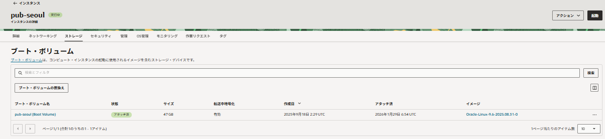
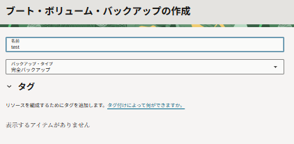
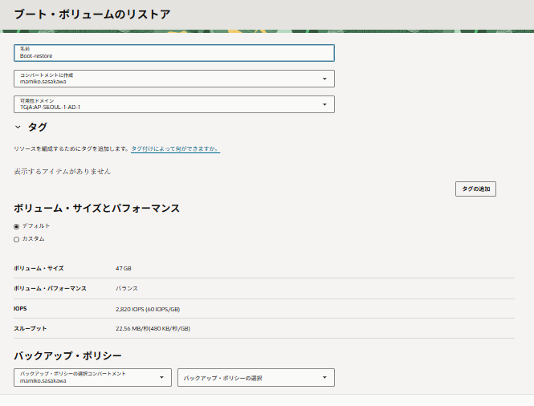
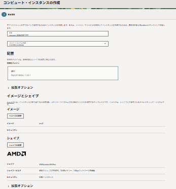
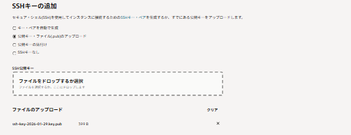
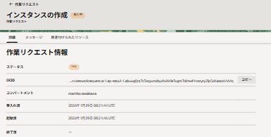
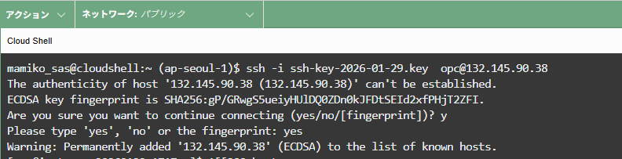
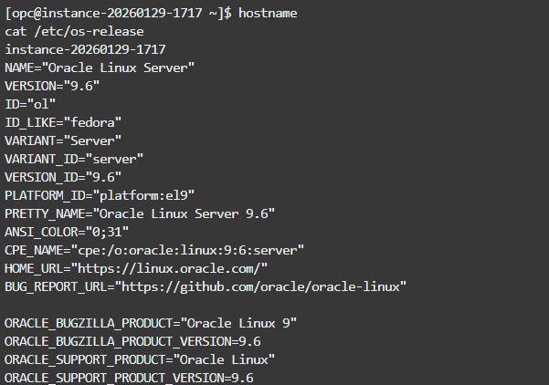

# OCIハンズオン-ブートボリュームバックアップ編

Computeインスタンスのブートボリュームバックアップを作成し、そこから新規インスタンスを作成します。

## 1. 前提

- 既存のComputeインスタンスが稼働中であること
- SSHキーペア（新規インスタンス接続用）

## 2. ブートボリュームバックアップの作成

### 2-1. ブートボリュームにアクセス

1. コンソールのナビゲーションメニューから [コンピュート]→ [インスタンス]を選択
2. バックアップ対象のインスタンス名をクリック
3. 左ペインの [リソース] セクションから [ブート・ボリューム] を選択
4. ブート・ボリューム名をクリック



### 2-2. バックアップを作成

1. ブート・ボリューム詳細画面で [ブート・ボリューム・バックアップ] を選択
2. [ブート・ボリューム・バックアップの作成] をクリック
3. 以下の設定で作成

|項目|設定値|
|---|---|
|名前|（任意の値）|
|バックアップ・タイプ|完全|

4. [ブート・ボリューム・バックアップの作成] をクリック



※バックアップの作成には数分かかる場合があります。ステータスが「使用可能」になるまでお待ちください。

## 3. バックアップからブートボリュームをリストア

1. コンソールのナビゲーションメニューから [ストレージ]→ [ブロック・ストレージ/ブート・ボリューム・バックアップ]を選択
2. 対象のバックアップの右側にある [⋮] メニューをクリック
3. [ブート・ボリュームのリストア] を選択
4. 以下の設定でリストア

|項目|設定値|
|---|---|
|名前|（任意の値）|
|コンパートメント|（自分のコンパートメント）|
|アベイラビリティ・ドメイン|（任意のAD）|

5. [ブート・ボリュームのリストア] をクリック



※リストアが完了するまで数分かかる場合があります。ステータスが「使用可能」になるまでお待ちください。

## 4. リストアしたブートボリュームから新規インスタンスを作成

### 4-1. インスタンス作成画面へ

1. コンソールのナビゲーションメニューから [ストレージ]→ [ブロック・ストレージ/ブート・ボリューム]を選択
2. リストアしたブート・ボリューム名をクリック
3. ブート・ボリューム詳細画面で [インスタンスの作成] をクリック



### 4-2. インスタンス設定

以下の設定でインスタンスを作成

|項目|設定値|
|---|---|
|名前|（任意の値）|
|コンパートメント|（自分のコンパートメント）|
|シェイプ|元のインスタンスと互換性のあるシェイプ|
|VCN|（任意のVCN）|
|サブネット|（任意のサブネット）|
|パブリックIPアドレス|パブリックIPv4アドレスの割当て|
|SSHキー|公開キーのアップロードまたは貼付け|

※シェイプは元のブートボリュームと互換性のあるものを選択してください。例えば、Intel系シェイプで作成されたブートボリュームはIntel系シェイプを選択します。





1. 設定完了後、[作成] をクリック

※インスタンスの作成には数分かかる場合があります。ステータスが「実行中」になるまでお待ちください。

## 5. 新規インスタンスへの接続確認

### 5-1. SSH接続

1. インスタンス詳細画面でパブリックIPアドレスを確認
2. ターミナルからSSH接続を実行

```bash
ssh -i <秘密鍵のパス> opc@<パブリックIPアドレス>
```

### 5-2. ホスト名・OS確認

接続後、以下のコマンドでホスト名とOS情報を確認

```bash
hostname
cat /etc/os-release
```

※元のインスタンスと同じOS、設定が引き継がれていることを確認してください。





## 6. クリーンアップ（オプション）

ハンズオン完了後、不要になったリソースを削除します。

### 6-1. 新規インスタンスの終了

1. コンソールのナビゲーションメニューから [コンピュート]→ [インスタンス]を選択
2. 削除対象のインスタンスの右側にある [⋮] メニューをクリック
3. [終了] を選択
4. 「ブート・ボリュームを完全に削除」にチェックを入れる
5. [インスタンスの終了] をクリック

### 6-2. リストアしたブートボリュームの削除（インスタンス作成に使用しなかった場合）

1. コンソールのナビゲーションメニューから [ストレージ]→ [ブロック・ストレージ/ブート・ボリューム]を選択
2. 削除対象のブート・ボリュームの右側にある [⋮] メニューをクリック
3. [終了] を選択

### 6-3. ブートボリュームバックアップの削除

1. コンソールのナビゲーションメニューから [ストレージ]→ [ブロック・ストレージ/ブート・ボリューム・バックアップ]を選択
2. 削除対象のバックアップの右側にある [⋮] メニューをクリック
3. [削除] を選択
